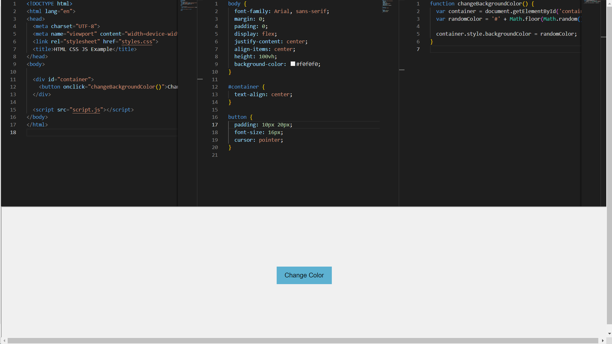

<!-- ABOUT THE PROJECT -->
# CodePen Clone


This project is a web-based code editor inspired by **CodePen**. Built with React and integrated with *Monaco Editor*. The real-time output is displayed below, providing an interactive coding experience.

Use the `README.md` to get started.

<!-- BUILT WITH -->
# Built With

The Tech Stacks used are:

<div align="center">
  <a href="https://skillicons.dev">
      
  </a>
</div>

## Installation

1. Clone the repository to your local machine:

   ```bash
   git clone https://github.com/Chetan3327/code-pen-clone.git
   ```
2. Navigate to the project directory:

   ```bash
   cd code-pen-clone
   ```
3. Install dependencies:

   ```bash
   npm install
   ```

<!-- CONTACT -->
# Contact

Name: Chetan Chauhan - chauhanchetan12789@gmail.com

Project Link: https://code-pen-clone-3327.netlify.app/
